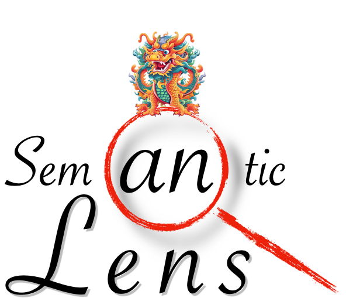

<p align="center">
    
</p>

<h2 align="center">Semantic Lens: Instance-Centric Semantic Alignment for Video Super-Resolution</h2>

<div align="center">
 <a href='https://arxiv.org/abs/2312.07823'></a> &nbsp;&nbsp;

</div>

<br>

<div align="center">
<span >Qi Tang<sup>1,2</sup>, Yao Zhao<sup>1,2</sup>, Meiqin Liu<sup>1,2*</sup>, <a href="https://jianjin008.github.io">Jian Jin</a><sup>3</sup>, <a href="https://yaochao1986.github.io">Chao Yao</a><sup>4*</sup></span></div>

<div align="center">
<sup>1</sup>Institute of Information Science, Beijing Jiaotong University, Beijing, China<br>
<sup>2</sup>Beijing Key Laboratory of Advanced Information Science and Network Technology, Beijing, China<br>
<sup>3</sup>Alibaba-NTU Singapore Joint Research Institute, Nanyang Technological University, Singapore<br>
<sup>4</sup>School of Computer and Communication Engineering, University of Science and Technology Beijing, Beijing, China
</div>

<br>

<p align="center">
    
</p>

<div align="center">
⭐ If you think Semantic-Lens is helpful for you, please help star this repo. Thanks! 🤗
</div>

## 🎬 Visualization

https://github.com/Tang1705/Semantic-Lens-AAAI24/assets/44370086/3f4fd155-19fa-4ff7-b905-f1779f451083

## 📎 Citation

Please cite our work if you think it is useful for your research.

```
@inproceedings{Tang2023AAAI,
  author = {Qi, Tang and Yao, Zhao and Meiqin, Liu and Jian, Jin and Yao, Chao},
  booktitle = {Proceedings of the AAAI Conference on Artificial Intelligence},
  title = {Semantic-Lens: Instance-Centric Semantic Alignment for Video Super-Resolution},
  year = {2023},
}
```

## 📭 Contact

If your have any comments or questions, feel free to contact qitang@bjtu.edu.cn.
